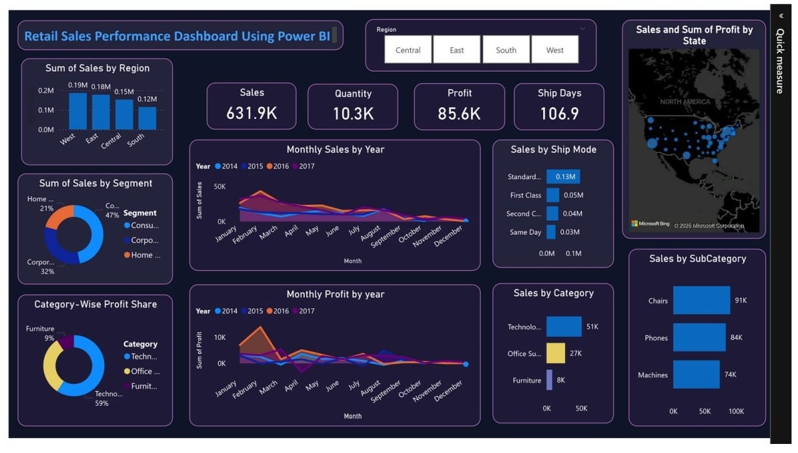
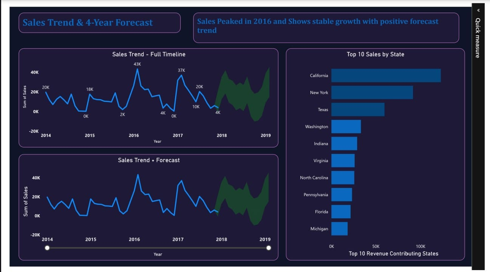

# Retail Sales Analytics Dashboard (Power BI)

End-to-end retail sales analytics project built using Power BI.  
This project analyzes 4 years of historical sales data to uncover trends, regional performance, and future forecasting insights.

## Project Overview
This dashboard transforms raw retail data into actionable business insights using interactive visualizations and KPI tracking.

## Key Features
- KPI tracking: Sales, Profit, Quantity, Shipping Days
- Regional and category performance analysis
- Monthly & yearly trend exploration
- Time-series forecasting for future growth
- Interactive slicers and drill-down analysis

## Tools & Skills Used
Power BI • Power Query • DAX • Data Cleaning • Data Modeling • Data Visualization

## Dataset
Superstore retail dataset (2014–2017)  
~10,000 sales records

## Outcome
Converted raw business data into a clear visual dashboard to support data-driven decision making.

##Dashboard Preview

## Author

Sureka. R

Aspiring Data Analyst skilled in SQL, Python, Power BI, Tableau, and Excel with a strong interest in business analytics and dashboard development.

